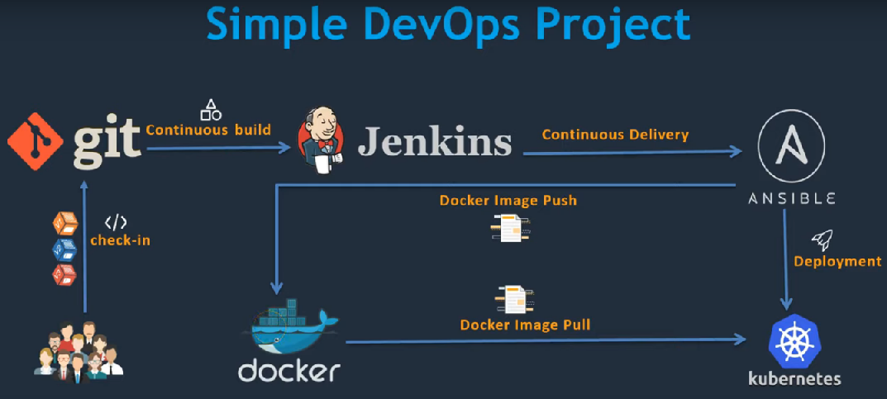

# E2E CI-CD Pipeline which includes the tools (GIT, MAVEN, JENKINS, ANSIBLE, DOCKER, KUBERNETES)

## Please find the below screenshot which illustrates the Flow.

## Relevant .MD files are in place.

\- [Kubernetes-setup](https://github.com/ravittanala/Continuous_Integration_1/blob/master/Kubernetes-setup.MD)

\- [Integrating_Kubernetes_with_Ansible](https://github.com/ravittanala/Continuous_Integration_1/blob/master/Integrating_Kubernetes_with_Ansible.MD)

\- [Integrating_Kubernetes_with_Jenkins](https://github.com/ravittanala/Continuous_Integration_1/blob/master/Integrating_Kubernetes_with_Jenkins.MD)
